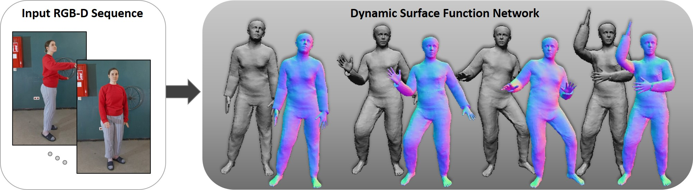

## DSFN: Dynamic Surface Function Networks for Clothed Human Bodies

*Andrei Burov, Matthias Nießner, Justus Thies*



We present a novel method for temporal coherent reconstruction and tracking of clothed humans. Given a monocular RGB-D sequence, we learn a person-specific body model which is based on a dynamic surface function network. To this end, we explicitly model the surface of the person using a multi-layer perceptron (MLP) which is embedded into the canonical space of the SMPL body model. With classical forward rendering, the represented surface can be rasterized using the topology of a template mesh. For each surface point of the template mesh, the MLP is evaluated to predict the actual surface location. To handle pose-dependent deformations, the MLP is conditioned on the SMPL pose parameters. We show that this surface representation as well as the pose parameters can be learned in a self-supervised fashion using the principle of analysis-by-synthesis and differentiable rasterization. As a result, we are able to reconstruct a temporally coherent mesh sequence from the input data. The underlying surface representation can be used to synthesize new animations of the reconstructed person including pose-dependent deformations.

[<a href="https://arxiv.org/pdf/2104.03978.pdf" target="_blank">Paper</a>][<a href="https://andreiburov.github.io/DSFN" target="_blank">Project</a>][<a href="https://youtu.be/4wbSi9Sqdm4" target="_blank">Video</a>]

# Cite

```
@misc{burov2021dsfn,
      title={Dynamic Neural Radiance Fields for Monocular 4D Facial Avatar Reconstruction}, 
      author={Andrei Burov and Matthias Nie{\ss}ner and Justus Thies},
      year={2021},
      eprint={2104.03978},
      archivePrefix={arXiv},
      primaryClass={cs.CV}
}
```

# License

DSFN is licensed under a [Creative Commons Attribution-NonCommercial-ShareAlike 4.0](https://creativecommons.org/licenses/by-nc-sa/4.0/).

Copyright (c) 2021 Andrei Burov, Matthias Nießner, Justus Thies
